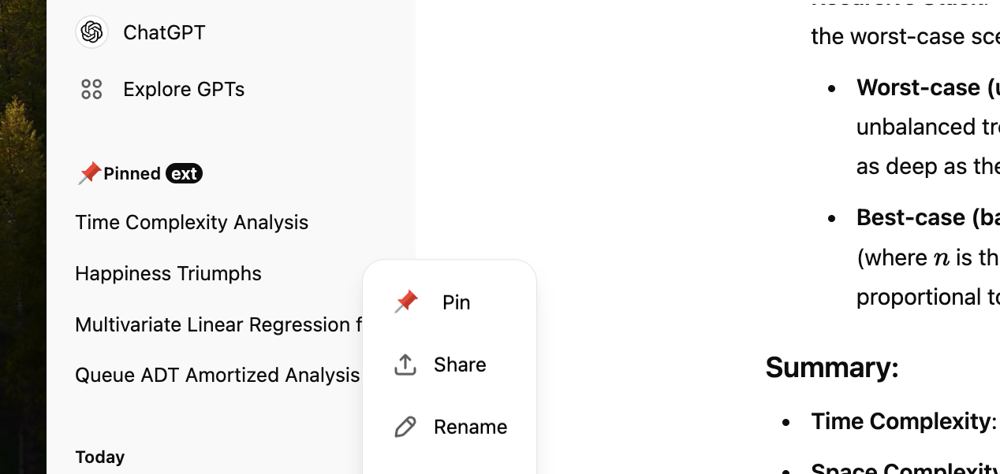
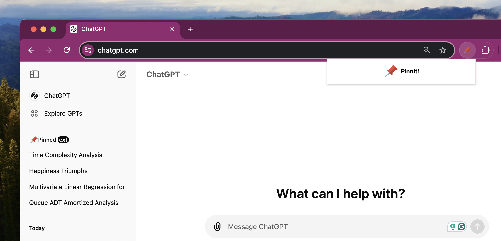

# Pinnit 📌

Pinnit is a browser extension that lets you pin and prioritize your ChatGPT tabs for quick access and easy management. By keeping your important conversations pinned, you can quickly revisit and continue them without searching through your history. It's perfect for users who want a more organized and efficient ChatGPT experience.

## **Privacy Policy for Pinnit**

**Effective Date:** October 9, 2024

### **1. Introduction**

Pinnit ("we," "us," or "our") is a browser extension designed to allow users to pin their ChatGPT tabs for easy access. This privacy policy outlines how we handle your data.

### **2. Information We Collect**

**No Personal Data Collected:**

We do not collect personally identifiable information, such as your name, email address, or any other personal details.

**Local Storage:**

Pinnit uses the browser's local storage to save user-selected pinned items. This data is stored solely for the purpose of maintaining your pinned items across sessions.

### **3. Data Usage**

The data stored is only used to provide the functionality of pinning and unpinning items within the extension. We do not share this data with third parties.

### **4. Security**

We take reasonable steps to protect the information you provide, but please remember that no method of transmission over the internet or method of electronic storage is 100% secure.

### **5. Changes to This Privacy Policy**

We may update this privacy policy from time to time. We will notify you of any changes by posting the new privacy policy on this page.

### **6. Contact Us**

If you have any questions about this privacy policy, please contact us at alfredboahene101@gmail.com.

## **Support for Pinnit**

Need assistance with Pinnit or have feedback to share? Fill out the support form below, and our team will get back to you as soon as possible. Please include detailed information about your issue or inquiry to help us serve you better. We appreciate your support and feedback!

Reach us here: https://forms.gle/NGXimqC8SguV2Mxo6
